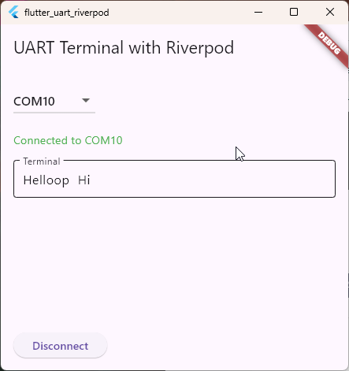

# flutter_uart_riverpod

UART handling code based on riverpod.
This code made with Grok3.
I need to talk to Grok for many times to let Grok know wrong behavior and errors and so on.
It's surprised that Grok, actually AI, works quite well and I realized that it's worth to pay for it.
I gave same request to oo.ai/perfectly/Grok and Grok gave more better answers than others.

## Getting Started

This is UART basic example code based on riverpod.
Actually I tried this feature and failed due to lack of knowledge about riverpod.
Riverpod has learning curve and it's not easy for me to understand it.
So, I made this code as a starting point for my future work with Grok and it's quite surprise than I expected.

## TODOs

- Add COM/Open/Close buttons to the UI.
- Fixed size at terminal window
- Add log window for user
- Fix overflow issue at widget, Port dropdown menu for now
- File log save feature add
- Special function key add
  - Ctrl + C - break
  - Copy and paste

## History (Latest first)

- 2025.03.18 First commit
  - Flutter 3.28.0-1.0.pre.70
  - Dart 3.7.0 (build 3.7.0-232.0.dev) • DevTools 2.41.0
